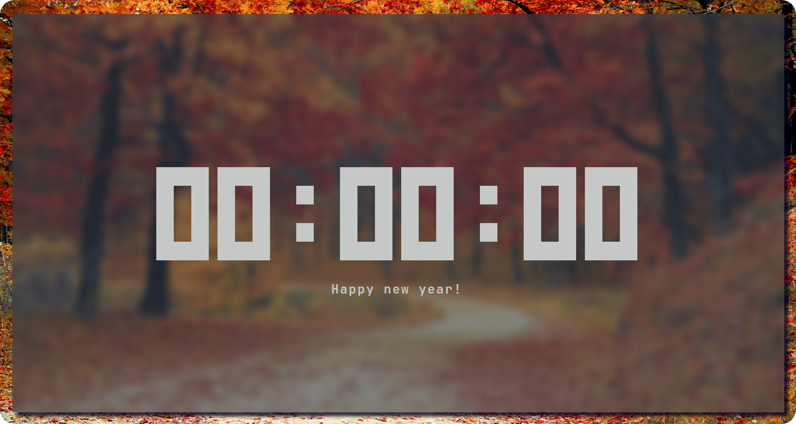
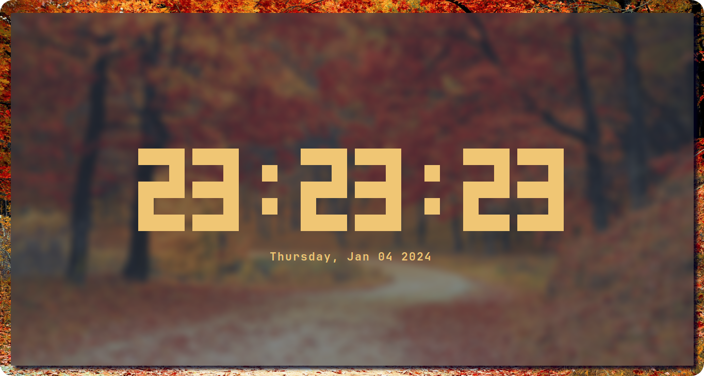
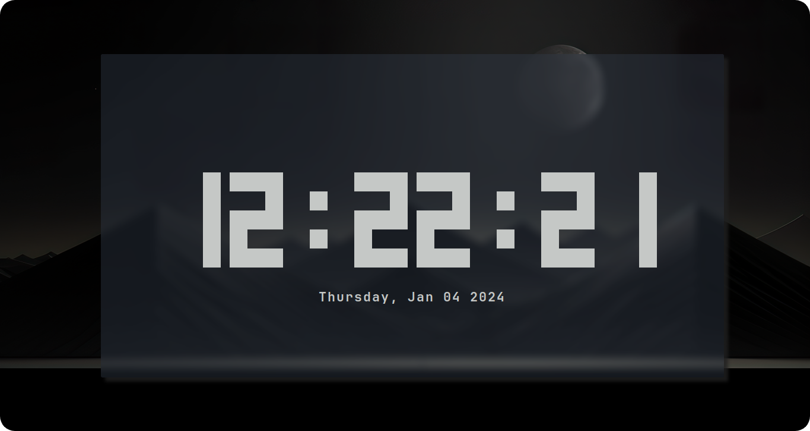
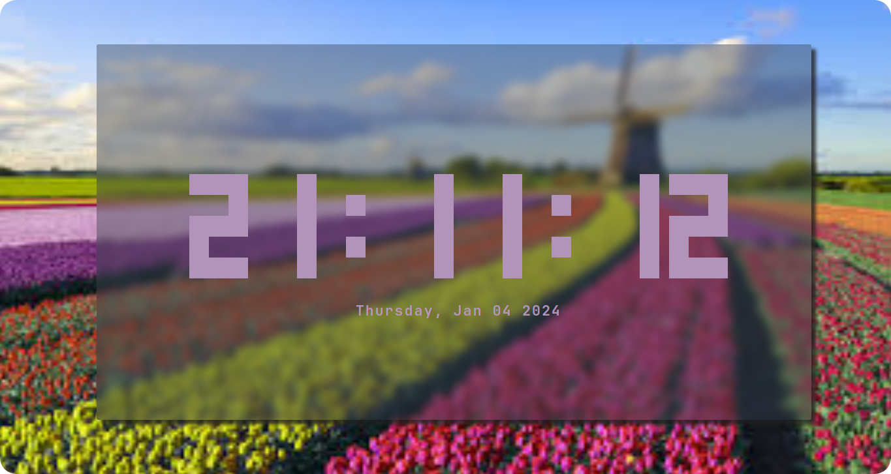
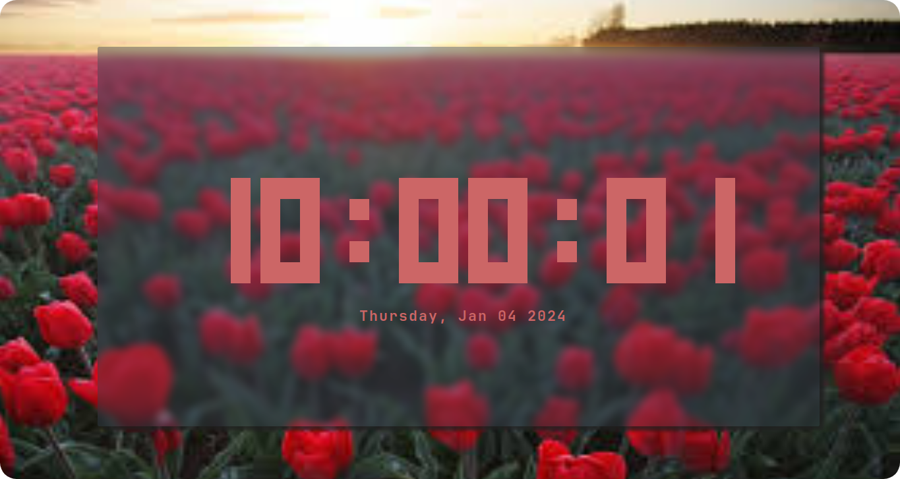

<div align="center">
    
    <h1></h1>
    <h3>A digital terminal clock written for POSIX systems, fully customizable with colors and datetime features</h3>
</div>


Rclock is a highly customizable digital clock for terminal interfaces written in C that runs on POSIX platforms, the included features of the clock are change the color of the components, optionally hide the date and the seconds, set a custom date and so on...

## Features
<ul>
    <li>Set a color to the clock</li>
    <li>Set a color to the date</li>
    <li>Set a color for each digit individually</li>
    <li>Set a color to the clock colons</li>
    <li>Set a color only for the digits</li>
    <li>Use a custom date format</li>
    <li>Set a custom hour</li>
    <li>Set a custom minute</li>
    <li>Set a custom second</li>
    <li>Set a custom time using the format xx:xx:xx</li>
    <li>Set a custom day</li>
    <li>Set a custom month</li>
    <li>Set a custom year</li>
    <li>Set a custom date using the format DD/MM/YYYY</li>
    <li>Hide the seconds</li>
    <li>Hide the date</li>
</ul>

# Table of contents
[Technical informations](#technical-informations)

[Installing the Rclock](#installing-the-rclock)

 - [Dependencies](#dependencies)

 - [Downloading the source code](#downloading-the-source-code)

 - [Building the Anemone library](#building-the-anemone-library)

 - [Setting up the Meson](#setting-up-the-meson)

 - [Compiling the source code](#compiling-the-source-code)

[Running the program for the first time](#running-the-program-for-the-first-time)

[Configuring a new color to the clock](#configuring-a-new-color-to-the-clock)

 - [Available colors](#available-colors)

 - [Rclock components](#rclock-components)

 - [Applying a new color](#applying-a-new-color)

[Displaying a custom date](#displaying-a-custom-date)

[Displaying a custom time](#displaying-a-custom-time)

[Making the clock smaller](#making-the-clock-smaller)

[Development documentation](#development-documentation)

[Gallery](#gallery)

# Technical informations
This software is built using the following technologies:
<ul>
    <li>C programming language</li>
    <li>Meson build system</li>
    <li>Ncurses library</li>
    <li>Anemone library</li>
</ul>

Tests performed on this software:
<ul>
    <li>Unit testing</li>
    <li>Integration testing</li>
</ul>

The software has a documentation, the description of the documentation is a [separete topic](#development-documentation).

# Installing the Rclock
Here is all you need to know for installing the Rclock.

## Dependencies
This software requires the following technologies to be installed in your machine:

### A compiler for the C language
The compiler used for developing the project was the GCC 13.2.1. Using the same compiler and the same version or newer is advisable.

### The Meson build system
The Meson build system documentation can be found on this link: https://mesonbuild.com/Getting-meson.html

### Ncurses library
The Ncurses library is also necessary to run the Rclock. This library is part of POSIX, so a Linux system typically has this library by default.

### Anemone library
The Anemone is a library used for command-line argument parsing. This library is defined as a submodule of this repository, so you don't need to worry about downloading it manually, however, a couple of commands will be necessary to pull and compile the source code.

## Downloading the source code
The source code of this repository can be downloaded with the following git command:

```sh
git clone --recursive https://github.com/Romulo-Moraes/Rclock.git
```

The *--recursive* flag is used for downloading the submodules beyond the repository source code.

## Building the Anemone library
The Anemone repository provides its own script for building the library, it's located on the root of the project. So to build the Anemone we need to run the following commands with the premise that you are currently at the root of the Rclock repository:

```sh
cd ./lib/Anemone
sh ./make_lib.sh
cd ../../
```
## Setting up the Meson
Once back to the Rclock root, we need to setup the Meson build system for compiling the repository. Use these commands to accomplish this task:

```sh
meson setup build
cd build
```
## Compiling the source code
After setting up the Meson, there are two options for compilation.

### Compiling
This option just compiles the project and creates the executable in the current directory.

```sh
meson compile
```

### Installing
This option compiles and also installs the executable globally on your machine.

```sh
sudo meson install
```

# Running the program for the first time
Once succesfully installed, the Rclock executable is visible globally and can now be run. To call the executable, simply type the following command in the terminal:

```sh
rclock
```

Running this command, the digital clock should be visible on screen with the default configurations.

# Configuring a new color to the clock
One of the most attractive features of the Rclock is the ability of set new colors for each component, there's a variety of command-line flags that can define new colors for each piece of the clock.

## Available colors
The Rclock has a set of built-in colors that are available to be used in any Rclock component.

<ul>
    <li>black</li>
    <li>red</li>
    <li>green</li>
    <li>yellow</li>
    <li>blue</li>
    <li>magenta</li>
    <li>white</li>
</ul>

## Rclock components
The Rclock is divided into components, this approach makes the development easier and increase the ways of customizations.

<ul>
    <li>Digits (Individually)</li>
    <li>Colons</li>
    <li>Date</li>
</ul>

## Applying a new color

### Clock color
This flag changes the color of all digits and all colons of the clock.
```txt
--clock-color or -c <color>
```

### Date color
This flag changes the color of the date.
```txt
--date-color or -d <color>
```

### Changing the color of the digits individually
The Rclock has the feature of change the color of each digit individually, this is compound by 6 flags. The digits are identified by a Roman number between 1 (I) to 6 (VI).
```txt
--color-I or -q <color>
--color-II or -Q <color>
--color-III or -P <color>
--color-IV or -p <color>
--color-V or -K <color>
--color-VI or -k <color>
```

### Colon color
This flag changes the color of both clock colons.
```txt
--colon-color or -o <color>
```

### Digits color
This flag changes the color of all clock digits.
```txt
--digits-color or -l <color>
```

# Displaying a custom date
It is possible to set a custom date to the Rclock, either individually or even using a date format.

### Custom day
The following flag sets a new day to the clock.
```txt
--custom-day or -D <month-day>
```

### Custom month
The following flag sets a new month to the clock.

```txt
--custom-month or -O <1-12>
```

### Custom year
The following flag sets a new year to the clock.
```txt
--custom-year or -Y <positive value>
```

### Custom date
The following flag sets a new day, month and year using a date format.
```txt
--custom-date or -D <DD/MM/YYYY>
```

### Custom date format
By default, the date is shown using a built-in format, however you can declare a new date format and the Rclock will use this instead of the default format.
```txt
--date-format or -f <strftime format>
```

This feature uses the format of the strftime C function. Here is the cheatsheet to help you design your own format:

| **Specifier** | **Replaced By**                                                        | **Example**              |
|:-------------:|:----------------------------------------------------------------------:|:------------------------:|
| %a            | Abbreviated weekday name                                               | Sun                      |
| %A            | Full weekday name                                                      | Sunday                   |
| %b            | Abbreviated month name                                                 | Mar                      |
| %B            | Full month name                                                        | March                    |
| %c            | Date and time representation                                           | Sun Aug 19 02:56:02 2012 |
| %d            | Day of the month (01-31)                                               | 19                       |
| %H            | Hour in 24h format (00-23)                                             | 14                       |
| %I            | Hour in 12h format (01-12)                                             | 05                       |
| %j            | Day of the year (001-366)                                              | 231                      |
| %m            | Month as a decimal number (01-12)                                      | 08                       |
| %M            | Minute (00-59)                                                         | 55                       |
| %p            | AM or PM designation                                                   | PM                       |
| %S            | Second (00-61)                                                         | 02                       |
| %U            | Week number with the first Sunday as the first day of week one (00-53) | 33                       |
| %w            | Weekday as a decimal number with Sunday as 0 (0-6)                     | 4                        |
| %W            | Week number with the first Monday as the first day of week one (00-53) | 34                       |
| %x            | Date representation                                                    | 08/19/12                 |
| %X            | Time representation                                                    | 02:50:06                 |
| %y            | Year, last two digits (00-99)                                          | 01                       |
| %Y            | Year                                                                   | 2012                     |
| %Z            | Timezone name or abbreviation                                          | CDT                      |
| %%            | A % sign                                                               | %                        |

The default format used by the project is the following:
```txt
"%A, %b %d %Y"
```

# Displaying a custom time
It is also possible to set a custom time to the Rclock, either individually or using a time format.

### Custom hour
This flag sets a new hour to the clock.
```txt
--custom-hour or H <0-23>
```

### Custom minute
This flag sets a new minute to the clock.
```txt
--custom-minute or-M <0-59>
```

### Custom second
This flag sets a new second to the clock.
```txt
--custom-second or -S <0-59>
```

 ### Custom time
This flag sets a new hour, minute and second using a time format.
```txt
--custom-time or -T <XX:XX:XX>
```

# Making the clock smaller
The Rclock can hide parts of itself to appear smaller than the normal.

### Hiding the date
This flag instructs the Rclock to hide the date until the end of its execution. This flag does not require a value.
```txt
--hide-date or -h
```

### Hiding the seconds
This flag instructs the Rclock to hide the seconds until the end of its execution. This flag does not require a value.
```txt
--hide-seconds or -i
```

### The passive ability
This project was designed to hide the date and the seconds automatically, so whenever the terminal be small enough to can't display the entire clock, the seconds will be hidden if the width is not large enough and the date will be hidden if the height not be big enough.

# Development documentation
This repository constains the whole software documentation inside the docs/ directory. The documentation is divided into three kinds of files:

<ul>
    <li>Requirements document</li>
    <li>The general Rclock documentation</li>
    <li>The documentation of each Rclock module</li>
</ul>

The documentation files are designed to help developers understand the project when creating new functionalities or for maintenance purposes.

# Gallery

<div align="center">
    <h2>Happy new year!</h2>
    
    <br/>
    <h2>Fall</h2>
    
    <br/>
    <h2>Moonlight</h2>
    
    <br/>
    <h2>Amsterdam</h2>
    
    <br/>
    <h2>Rose valley</h2>
    
    <br/>
    <h2>Japan</h2>
    
</div>
