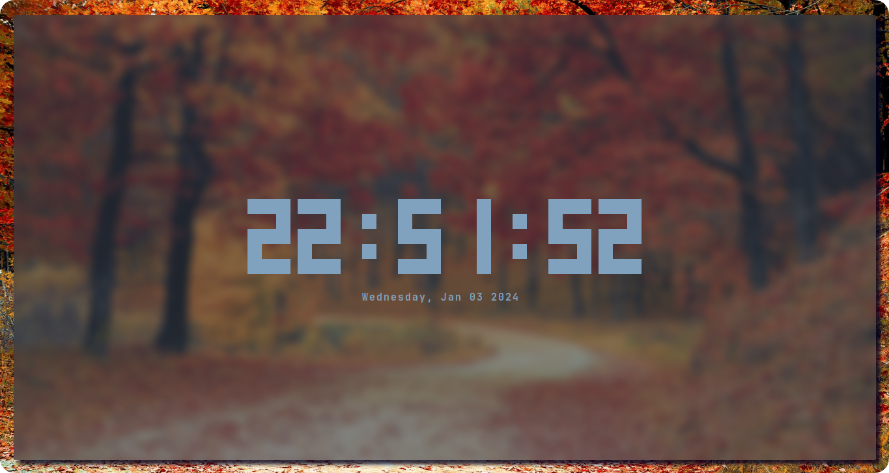

<div align="center">
    
    <h1></h1>
    <h3>A digital terminal clock written for POSIX systems, fully customizable with colors and datetime features</h3>
</div>


Rclock is a highly customizable digital clock for terminal interfaces written in C that runs on POSIX platforms, the included features of the clock are change the color of the components, optionally hide the date and the seconds, set a custom date and so on...

## Features
<ul>
    <li>Set a color to the clock</li>
    <li>Set a color to the date</li>
    <li>Set a color for each digit individually</li>
    <li>Set a color to the clock colons</li>
    <li>Set a color only for the digits</li>
    <li>Use a custom date format</li>
    <li>Set a custom hour</li>
    <li>Set a custom minute</li>
    <li>Set a custom second</li>
    <li>Set a custom time using the format xx:xx:xx</li>
    <li>Set a custom day</li>
    <li>Set a custom month</li>
    <li>Set a custom year</li>
    <li>Set a custom date using the format DD/MM/YYYY</li>
    <li>Hide the seconds</li>
    <li>Hide the date</li>
</ul>

# Table of contents
[Technical informations]()

[Installing the Rclock]()

[Running the program for the first time]()

[Configuring a new color to the clock]()

[Configuring a custom date]()

[Configuring a custom date format]()

[Configuring a custom time]()

[Making the clock smaller]()

[Development documentation]()

## Technical informations
This software was built using the following technologies
<ul>
    <li>C programming language</li>
    <li>Meson build system</li>
    <li>Ncurses library</li>
    <li>Anemone library</li>
</ul>


# Installing the Rclock
This software requires the following technologies to be installed in your machine:

### A compiler for the C language
The compiler used for developing the project was the GCC 13.2.1. Using the same compiler and the same version or newer is advisable.

### The meson build system
The meson build system documentation can be found on this link: https://mesonbuild.com/Getting-meson.html

### Ncurses library
The Ncurses library is also necessary to run the Rclock. This library is part of POSIX, so a Linux system typically has this library by default.

### Anemone library
The Anemone is a library used for command-line argument parsing. This library is defined as a submodule of this repository, so you don't need to worry about downloading it manually, however, a couple of commands will be necessary to pull and compile the source code.

## Downloading the source code
The source code of this repository can be downloaded with the following git command:

```sh
git clone --recursive https://github.com/Romulo-Moraes/Rclock.git
```

The *--recursive* flag is used for downloading the submodules beyond the repository source code.

## Building the Anemone library
The Anemone repository provides its own script for building the library, it's located on the root of the project. So to build the Anemone we need to run the following commands with the premise that you are currently at the root of the Rclock repository:

```sh
cd ./lib/Anemone
sh ./make_lib.sh
cd ../../
```
## Setting up the Meson
Once back to the Rclock root, we need to setup the Meson build system for compiling the repository. Use these commands to accomplish this task:

```sh
meson setup build
cd build
```
## Compiling the source code
After setting up the Meson, there are two options for compilation.

### Compiling
This option just compiles the project and creates the executable in the current directory.

```sh
meson compile
```

### Installing
This option compiles and also installs the executable globally on your machine.

```sh
sudo meson install
```

# Running the program for the first time
Once succesfully installed, the Rclock executable is visible globally and can now be run. To call the executable, simply type the following command in the terminal:

```sh
rclock
```

Running this command, the digital clock should be visible on screen with the default configurations.

# Configuring a new color to the clock
One of the most attractive features of the Rclock is the hability of set new colors for each component, there's a variety of command-line flags that can define new colors for each piece of the clock,