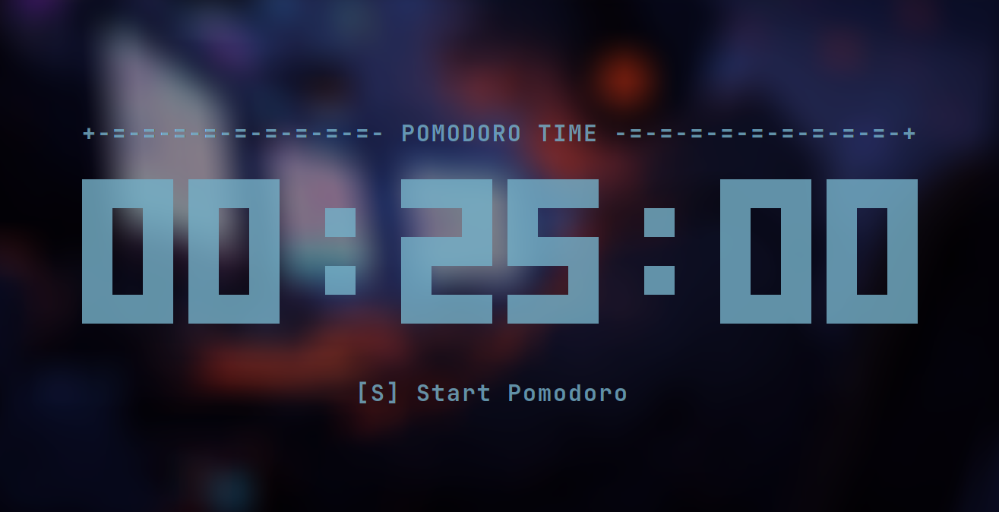

<div align="center">
    
    <h1></h1>
    <h3>A digital terminal clock written for POSIX systems, fully customizable with colors and datetime features</h3>
</div>


Rclock is a highly customizable digital clock for terminal interfaces written in C that runs on POSIX platforms, the included features of the Rclock are the possibility of change the color of the components, optionally hide the date and the seconds, set a custom date and so on...

## Features list
<ul>
    <li>Set a color to the clock</li>
    <li>Set a color to the date</li>
    <li>Set a color for each digit individually</li>
    <li>Set a color to the clock colons</li>
    <li>Set a color only for the digits</li>
    <li>Use a custom date format</li>
    <li>Set a custom hour</li>
    <li>Set a custom minute</li>
    <li>Set a custom second</li>
    <li>Set a custom time using the format xx:xx:xx</li>
    <li>Set a custom day</li>
    <li>Set a custom month</li>
    <li>Set a custom year</li>
    <li>Set a custom date using the format DD/MM/YYYY</li>
    <li>Hide the seconds</li>
    <li>Hide the date</li>
    <li>Pomodoro mode</li>
</ul>

# Table of contents
[Technical informations](#technical-informations)

[Installing the Rclock](#installing-the-rclock)

 - [Dependencies](#dependencies)

 - [Downloading the source code](#downloading-the-source-code)

 - [Building the Anemone library](#building-the-anemone-library)

 - [Setting up the Meson](#setting-up-the-meson)

 - [Compiling the source code](#compiling-the-source-code)

[Running the program for the first time](#running-the-program-for-the-first-time)

[Configuring a new color to the clock](#configuring-a-new-color-to-the-clock)

 - [Available colors](#available-colors)

 - [Rclock components](#rclock-components)

 - [Applying a new color](#applying-a-new-color)

[Displaying a custom date](#displaying-a-custom-date)

[Displaying a custom time](#displaying-a-custom-time)

[Making the clock smaller](#making-the-clock-smaller)

[Pomodoro mode](#pomodoro-mode)

[Gallery](#gallery)

# Technical informations
This software is built using the following technologies:
<ul>
    <li>C programming language</li>
    <li>Meson build system</li>
    <li>Ncurses library</li>
    <li>Anemone library</li>
</ul>

Tests performed on this software:
<ul>
    <li>Unit testing</li>
    <li>Integration testing</li>
</ul>

<br>

# Installing the Rclock
Here is all you need to know to install and run the Rclock.

## Dependencies


### A compiler for the C language
The compiler used for developing the Rclock was the GCC 13.2.1. Using the same compiler and the same/newer versions is advisable.

### The Meson build system
The Meson build system documentation can be found on this link: https://mesonbuild.com/Getting-meson.html

### Ncurses library
The Rclock uses the Ncurses library to create and manipulate components on screen. This library is part of POSIX, a Linux system typically has this library by default.

### Anemone library
The Anemone is a library used for command-line argument parsing. This library is defined as a submodule of this repository, so you don't need to worry about downloading it manually, however, a couple of commands will be necessary to pull and compile the source code.

## Downloading the source code
The source code of this repository can be downloaded with the following git command:

```sh
git clone --recursive https://github.com/Romulo-Moraes/Rclock.git
```

The *--recursive* flag is used for downloading the submodules beyond the repository source code itself.

## Building the Anemone library
The Anemone repository provides its own script for building the library, it's located on the root of the project. So to build the Anemone we need to run the following commands with the premise that you are currently at the root of the Rclock repository:

```sh
cd ./lib/Anemone
sh ./make_lib.sh
cd ../../
```
## Setting up the Meson
Once back to the Rclock root, we need to setup the Meson build system for compiling the repository. Running these commands should accomplish this task:

```sh
meson setup build
cd build
```
## Compiling the source code
After setting up the Meson, there are two possible ways to build the application.

### Compiling
This option just compiles the project and creates the executable in the current directory.

```sh
meson compile
```

### Installing
This option compiles and also installs the executable globally on your machine.

```sh
sudo meson install
```

# Running the program for the first time
Once succesfully installed, the Rclock executable is visible globally on your system and can now be ran. To launch the application, simply type the following command on the terminal:

```sh
rclock
```

After running this command, the digital clock should be visible on screen with the default configurations.

# Configuring a new color to the clock
One of the most attractive features of the Rclock is the ability of set new colors for each component, there is a variety of command-line flags that can define new colors for each piece of the clock.

## Available colors
The Rclock has a set of built-in colors that are available to be used in any Rclock component.

<ul>
    <li>black</li>
    <li>red</li>
    <li>green</li>
    <li>yellow</li>
    <li>blue</li>
    <li>magenta</li>
    <li>white</li>
</ul>

## Rclock components
The Rclock is divided into components, this approach makes the development easier and increase the ways of customizations.

<ul>
    <li>Digits (Individually)</li>
    <li>Colons</li>
    <li>Date</li>
</ul>

## Applying a new color

### Clock color
This flag changes the color of all digits and all colons of the clock.
```txt
--clock-color or -c <color>
```

### Date color
```txt
--date-color or -d <color>
```

### Changing the color of the digits individually
You can change the color of the digits individually by passing the flag `--color` with a roman number between 1 (I) and 6 (VI), or its corresponding short version.
```txt
--color-I or -q <color>
--color-II or -Q <color>
--color-III or -P <color>
--color-IV or -p <color>
--color-V or -K <color>
--color-VI or -k <color>
```

### Colons color
```txt
--colon-color or -o <color>
```

### Digits color

```txt
--digits-color or -l <color>
```

# Displaying a custom date
It is possible to set a custom date to the Rclock, either individually or using a date format.

### Custom day
```txt
--custom-day or -D <month-day>
```

### Custom month
```txt
--custom-month or -O <1-12>
```

### Custom year
```txt
--custom-year or -Y <positive value>
```

### Custom date
The following flag sets a new day, month and year using a date format.
```txt
--custom-date or -D <DD/MM/YYYY>
```

### Custom date format
By default, the date is shown using a built-in format, however, you can declare a new date format and the Rclock will use it instead of the default format.
```txt
--date-format or -f <strftime format>
```

This feature uses the replacement strategy of the strftime C function, so here is the cheatsheet to help you design your own format:

| **Specifier** | **Replaced By**                                                        | **Example**              |
|:-------------:|:----------------------------------------------------------------------:|:------------------------:|
| %a            | Abbreviated weekday name                                               | Sun                      |
| %A            | Full weekday name                                                      | Sunday                   |
| %b            | Abbreviated month name                                                 | Mar                      |
| %B            | Full month name                                                        | March                    |
| %c            | Date and time representation                                           | Sun Aug 19 02:56:02 2012 |
| %d            | Day of the month (01-31)                                               | 19                       |
| %H            | Hour in 24h format (00-23)                                             | 14                       |
| %I            | Hour in 12h format (01-12)                                             | 05                       |
| %j            | Day of the year (001-366)                                              | 231                      |
| %m            | Month as a decimal number (01-12)                                      | 08                       |
| %M            | Minute (00-59)                                                         | 55                       |
| %p            | AM or PM designation                                                   | PM                       |
| %S            | Second (00-61)                                                         | 02                       |
| %U            | Week number with the first Sunday as the first day of week one (00-53) | 33                       |
| %w            | Weekday as a decimal number with Sunday as 0 (0-6)                     | 4                        |
| %W            | Week number with the first Monday as the first day of week one (00-53) | 34                       |
| %x            | Date representation                                                    | 08/19/12                 |
| %X            | Time representation                                                    | 02:50:06                 |
| %y            | Year, last two digits (00-99)                                          | 01                       |
| %Y            | Year                                                                   | 2012                     |
| %Z            | Timezone name or abbreviation                                          | CDT                      |
| %%            | A % sign                                                               | %                        |

This is the default format used by the project:
```txt
"%A, %b %d %Y"
```

# Displaying a custom time
It is also possible to set a custom time to the Rclock, either individually or using a time format.

### Custom hour
```txt
--custom-hour or -H <0-23>
```

### Custom minute
```txt
--custom-minute or -M <0-59>
```

### Custom second
```txt
--custom-second or -S <0-59>
```

 ### Custom time
This flag sets a new hour, minute and second using a time format.
```txt
--custom-time or -T <XX:XX:XX>
```

# Making the clock smaller
The Rclock can hide a group of components to make itself smaller, useful for limited space or personal taste.

### Hiding the date
```txt
--hide-date or -h
```

### Hiding the seconds
```txt
--hide-seconds or -i
```

### The passive ability
This Rclock was designed to hide the date and seconds automatically, so whenever the terminal be small enough  at the point of not being possible to render the clock correctly, the seconds will be hidden to free horizontal space, and the date will be hidden to free vertical space.

# Pomodoro mode
In the newer versions of the Rclock, the Pomodoro mode was implemented and can now be easily accessed through a new optional flag

## How does it work ?
The Pomodoro mode is a implementation of the Pomodoro Technique, that is a time management method that breaks work into intervals of 25 minutes, separated by short breaks. Each interval is known as a <i>Pomodoro</i>, and each short break is known as a Rest time on Rclock.

By default, the rest time is 5 minutes length, but after completing 3 pomodoro sessions, you will be given a rest time of 15 minutes, restarting the process after that.

## Using the Pomodoro mode
To launch the Rclock on Pomodoro mode, you must pass the flag `--pomodoro` to the program. This command shall make the clock show up, ready to start a new pomodoro.



The Rclock itself lists the possible commands below the clock, so you can perform operations based on the current progress of your pomodoro, like start, pause, unpause and stop the alarm once the clock has reached `00:00`.

## Leaving the pomodoro mode
Differently from the normal clock, you can't leave the pomodoro by just hitting enter on your keyboard.

With the goal of avoid leaving the pomodoro session by accident and yet, keeping the practicality of a menuless approach, you must hit enter 3 times in a interval of `350` milliseconds. This should close the application and return the terminal to its default configuration.

<br/>

# Gallery

<div align="center">
    <h2>Happy new year!</h2>
    
    <br/>
    <h2>Fall</h2>
    
    <br/>
    <h2>Moonlight</h2>
    
    <br/>
    <h2>Amsterdam</h2>
    
    <br/>
    <h2>Rose valley</h2>
    
    <br/>
    <h2>Japan</h2>
    
</div>
